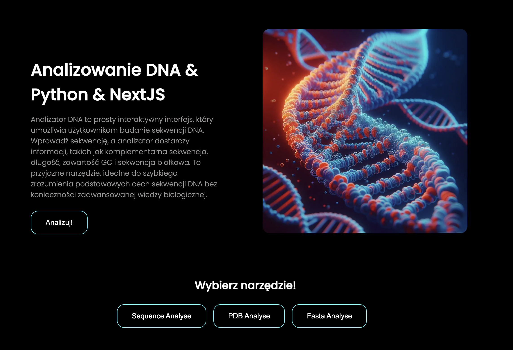
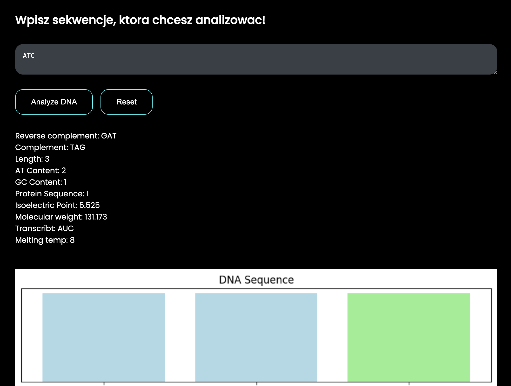

# Bioinformatics Analysis Project

## Overview

This project is a bioinformatics analysis tool developed in Python (using Biopython) for processing and analyzing biological data. The analysis involves PDB (Protein Data Bank) files, FASTA files, and DNA sequences. Additionally, a web interface built with Next.js is provided for a user-friendly interaction with the tool.

## Features

- **PDB File Analysis:**

- **FASTA File Analysis:**

- **DNA Sequence Analysis:**

- **Web Interface (Next.js):**
